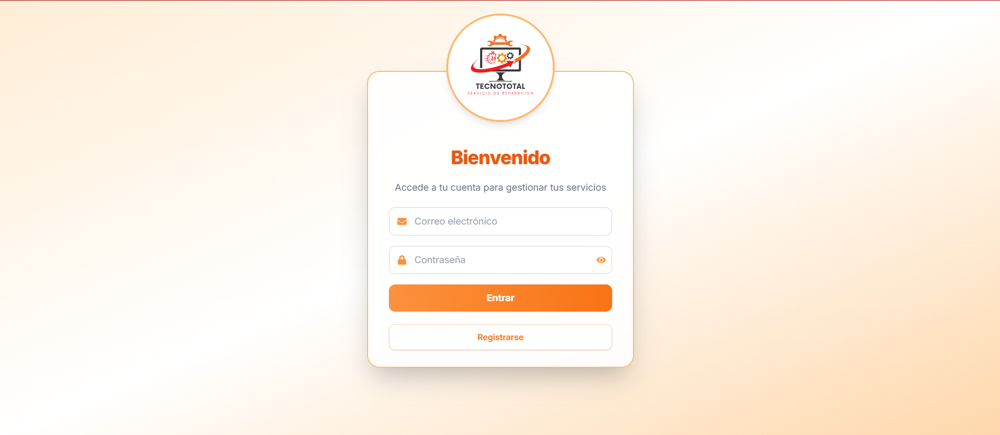
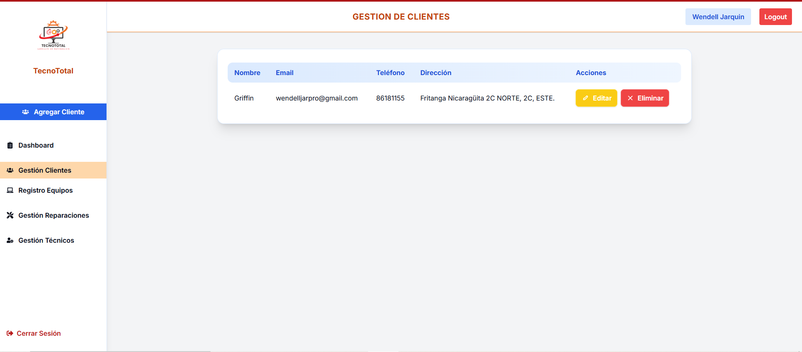
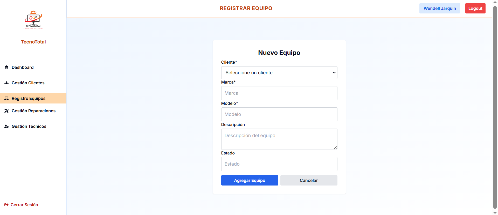
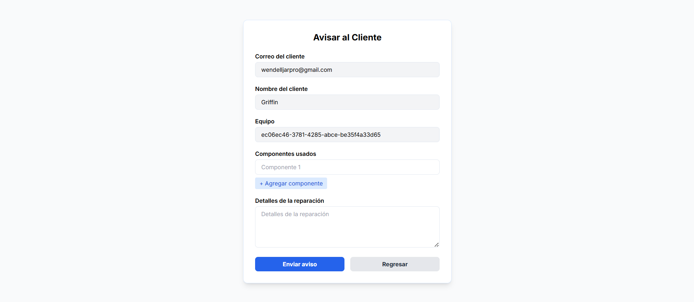

README.md – Proyecto Tecno Total
===============================

1. Título y Descripción
------------------------
Nombre del proyecto: Tecno Total

Descripción breve:
Tecno Total es un sistema de gestión de reparaciones de equipos. Permite registrar a los clientes y los dispositivos que han dejado para reparación. 
A medida que el estado de la reparación avanza, el sistema notifica automáticamente al cliente por correo electrónico sobre los cambios.

Tecnologías utilizadas:
- Backend: NestJS
- Frontend: NextJS
- Base de datos: PostgreSQL

2. Requisitos Previos
----------------------
Asegúrate de tener instalados:
- Node.js v18+
- PostgreSQL v15+
- Yarn o npm
- Docker (opcional)

3. Instalación y Configuración
-------------------------------
Clona los repositorios:

Frontend:
git clone https://github.com/Wendell-Jarquin/TecnoTotalFrontend.git
cd TecnoTotalFrontend

Backend:
git clone https://github.com/Wendell-Jarquin/TecnoTotalBackend.git
cd TecnoTotalBackend

Instala las dependencias:
npm install  ó  yarn install

Configura las variables de entorno (.env):

DB_HOST=localhost
DB_PORT=5432
DB_USERNAME=postgres
DB_PASSWORD=root
DB_NAME=tecnot

JWT_SECRET=tu_clave_secreta
MAIL_USER=your_email@gmail.com
MAIL_PASS=your_email_app_password

4. Ejecución del Proyecto
--------------------------
Frontend (NextJS):
npm run dev

Backend (NestJS):
npm run start:dev

5. Uso del Sistema
-------------------
Endpoints clave (desde el backend):
- POST /auth/login         – Autenticación de usuarios
- POST /clientes           – Registro de clientes
- POST /equipos            – Registro de equipos en reparación
- PATCH /reparaciones/:id  – Cambiar estado de reparación

1.
 

2.
 

3.
 

5.
 

6.
 

Documentación Swagger:
http://localhost:3000/api

6. Estructura de Carpetas
--------------------------
TecnoTotalFrontend/
  ├── pages/
  ├── components/
  ├── styles/
  └── public/

TecnoTotalBackend/
  ├── src/
      ├── auth/
      ├── clientes/
      ├── equipos/
      ├── reparaciones/
      ├── mailer/
      └── main.ts

7. Características Destacadas
------------------------------
- Sistema modular con NestJS
- Interfaz moderna con NextJS y TailwindCSS
- Gestión y seguimiento de reparaciones en tiempo real
- Notificaciones automáticas por correo electrónico al cliente
- Seguridad con JWT y validación de usuarios

8. Posibles Mejoras Futuras
----------------------------
- Integración con WhatsApp API
- Dashboard de estadísticas
- Subida de imágenes de los equipos reparados
- Histórico de reparaciones por cliente

9. Licencia
-----------
Este proyecto es privado y no posee una licencia específica. Su uso está limitado al propietario.

10. Autor
---------
Desarrollado por Wendell Jarquín (github.com/Wendell-Jarquin)

11. Información detallada del Frontend
------------------------------------------
El frontend de Tecno Total está construido con **Next.js 14**, **React 18** y **TailwindCSS**, siguiendo una arquitectura modular moderna y escalable.

Configuración del `package.json`:
{
  "name": "tecnototal-frontend",
  "version": "0.1.0",
  "private": true,
  "scripts": {
    "dev": "next dev",
    "build": "next build",

    "start": "next start",
    "lint": "next lint"
  },
  "dependencies": {
    "@radix-ui/react-label": "^2.1.6",
    "@radix-ui/react-slot": "^1.2.2",
    "chart.js": "^4.4.9",
    "class-variance-authority": "^0.7.1",
    "clsx": "^2.1.1",
    "lucide-react": "^0.510.0",
    "next": "14.2.28",
    "react": "^18",
    "react-chartjs-2": "^5.3.0",
    "react-dom": "^18",
    "react-hook-form": "^7.56.4",
    "react-icons": "^5.5.0",
    "tailwind-merge": "^3.3.0",
    "tailwindcss-animate": "^1.0.7"
  },
  "devDependencies": {
    "@types/node": "^20",
    "@types/react": "^18",
    "@types/react-dom": "^18",
    "eslint": "^8",
    "eslint-config-next": "14.2.28",
    "postcss": "^8",
    "tailwindcss": "^3.4.1",
    "typescript": "^5"
  }
}

Componentes clave en el frontend:

- Formularios validados con `react-hook-form`
- Visualización de datos con `react-chartjs-2`
- Estilos modernos con `TailwindCSS` y `clsx`
- Íconos con `lucide-react` y `react-icons`
- Animaciones ligeras (`tailwindcss-animate`)
- Accesibilidad con Radix UI

Diseño enfocado en:
- Facilidad de uso
- Interfaz responsiva y accesible
- Interacción fluida con el backend mediante API REST
